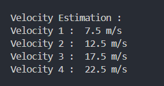
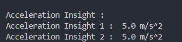
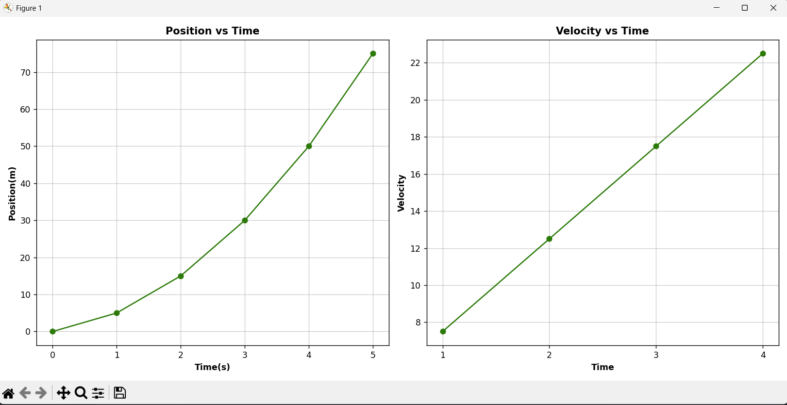
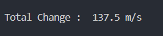

<h2>Velocity Table</h2>

A table showing the instantaneous velocity at t=1, 2, 3, and 4 sseconds. 
            x(t+1) - x(t-1)
Formula :---------------------
                   2

<h2>Graphs</h2>

<b>Position vs Time</b> : Showing the car's movement
<b>Velocity vs Time</b> : Showing how the speed changed over the 5-second window.

<h2>Distance Estimation Comparison</h2>

Compare the total displacement you calculated using the Trapezoidal Rule against the "actual" displacement from your data table.

<h2>Short Analysis Report</h2>

The vehicle exhibits continuous acceleration throughout the observed interval from t=1 to t=5, as evidenced by a steady increase in velocity from 7.5 m/s to 22.5 m/s. This behavior confirms that the motion is non-uniform, as the velocity is not constant instead, the data demonstrates a constant acceleration of 5.0  m/s^2, which is characteristic of uniformly accelerated motion. Furthermore, the dataset remains stable and consistent, with no sudden spikes or anomalies observed in the position or velocity profiles, indicating reliable sensor performance and a highly predictable physical movement pattern.

