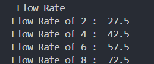
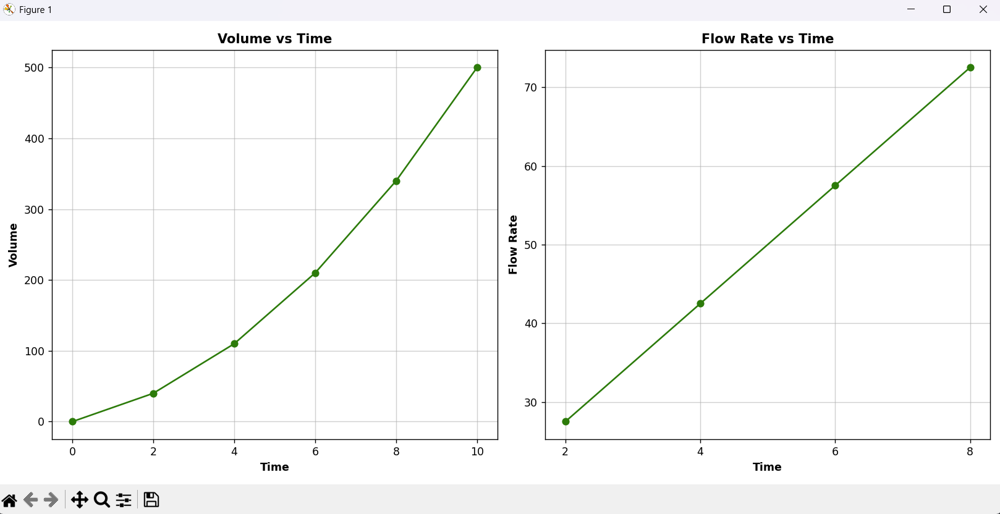

<h2>Table of Flow Rates</h2>

calculate the inflow rate V'(t) at t = 2, 4, 6, and 8 minutes. Using the Central difference formula: V'(t) ≈ V(t+h) - V(t-h) / 2*h. where h = 2

<h2>Integrated total volume</h2>

Use the Trapezoidal Rule to estimate the total volume accumulated over the interval.

<h2>Graphs</h2>

<b>Volume vs Time :</b> Plot of the raw sensor data provided in the table.

<b>Flow Rate vs Time :</b> A plot of the derivatives calculated, showing how the inflow rate changes over time.

<h2>Short Analysis Report</h2>

The derivative at each given time is its flow rate or rate of change, and the graph shows that there is an increasing trend which means that the inflow is currently accelerating. The area under the time and volume graph at points 0 to 10 is the total accumulation of volume which was calculated using the trapezoidal rule.

